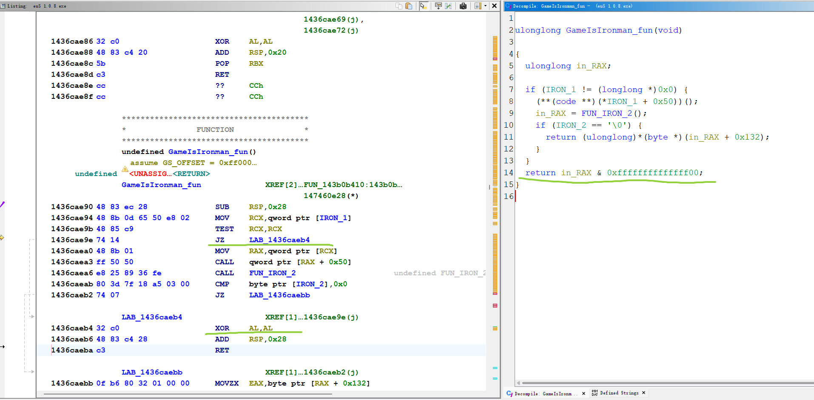

<div align="center">

# 🏆 EU5 Patcher

### Enable Achievements Unconditionally

[](LICENSE)
[]()
[]()

</div>

---

## 📖 About

The debate over whether **unmodified ironman mode** should be required to unlock achievements has been going on for years. While Crusader Kings III and Stellaris took a player-friendly approach, Europa Universalis V unfortunately stepped backward. Therefore, I decide to make this patcher, which can enable partial achievements in non-ironman mode or enable all achievements in ironman mode. You can save & load just as non-ironman mode in your ironman game.


| Mode        | Mod   | Setting | Console              | Save & Load          | Achievement Status |
| ----------- | ----- | ------- | -------------------- | -------------------- | ------------------ |
| Non-Ironman | ✅ Any | ✅ Any   | ✅ Yes                | ✅ Yes                | ⚠️ Partial          |
| **Ironman** | ✅ Any | ✅ Any   | ✅ <ins>**Yes**</ins> | ✅ <ins>**Yes**</ins> | ✅ All              |


> [!NOTE]
> Some achievements will not be triggered in non-ironman mode. So I recomment the ironman mode since you can save and load as normal.

<div align="center">

</div>

---
## 🚀 How to Use
> [!TIP]
> You’ll need to patch `eu5.exe` after every game update.

### 🐍 Option 1: Python

```bash
# 1. Navigate to game directory where eu5.exe exists
cd ".../Europa Universalis V/binaries/"

# 2. Put patch.py into the folder and run the patch script
python patch.py
```

### ⚙️ Option 2: C++

```bash
# 1. Compile the source
cl /std:c++17 /O2 /EHsc patch.cpp

# 2. Move patch.exe to game directory where eu5.exe exists and run it
```

### ⚠️ Option 3: Pre-built EXE

> [!WARNING]
> Running unknown executables is risky. Only proceed if you fully trust the source.

1. Download `patch.exe` from the [📦 Releases page](https://github.com/UFOdestiny/EU5-Patcher/releases/)
2. Place it in `.../Europa Universalis V/binaries/` where eu5.exe exists
3. Run it

---

## ✅ After Patching

If everything goes well, you'll see:

```
EU5 is successfully patched.
```

> [!TIP]
> The trophy and ironman icon may appear **red** in the settings menu at first. Simply start the game, and it will turn **green**.

---

## 📘 Tutorial
<div align="center">

</div>

<div align="center">

</div>

---

## 🙌 Credits

This project was created primarily for learning and skill development. It was inspired by:

- 🔗 [Enabling Achievements in Stellaris With Mods (All game versions) [SRE]](https://steamcommunity.com/sharedfiles/filedetails/?id=2460079052)