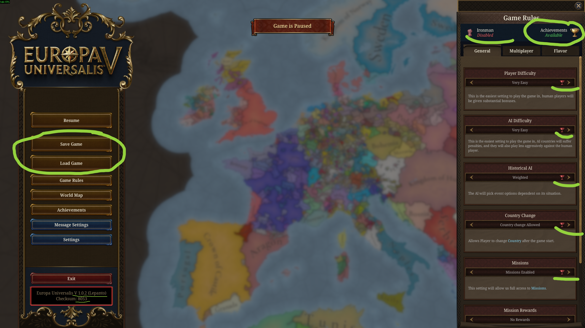

<div align="center">

# 🏆 EU5 Patcher

### Enable Achievements Unconditionally
##### - Fork which disables loading saves in ironman mode

[中文](README_CN.md) | [English](README.md)

[](LICENSE)
[]()
[]()

</div>

---

## 📖 About

The debate over whether **unmodified ironman mode** should be required to unlock achievements has been going on for years. While games like *Crusader Kings III* and *Stellaris* have adopted a more player-friendly approach, *Europa Universalis V* has unfortunately taken a step back.

This patcher allows you to:
- Enable partial achievements in non-ironman mode.
- Enable **all achievements** in ironman mode, while allowing you to **save & load** freely (just like in non-ironman mode).

| Mode        | Mod   | Setting  | Console              | Save & Load          | Achievement Status |
| ----------- | ----- | -------- | -------------------- | -------------------- | ------------------ |
| Non-Ironman | ✅ Any | ✅ Any   | ✅ Yes                | ✅ Yes                | ⚠️ Partial          |
| **Ironman** | ✅ Any | ✅ Any   | ✅ <ins>**Yes**</ins> | ❌ No              | ✅ All              |


> [!NOTE]
> Some achievements may not trigger in non-ironman mode. We **recommend** using ironman mode with this patch, as it grants full achievement access while retaining save/load functionality.

<div align="center">

</div>

---
## 🚀 How to Use
> [!TIP]
> You will need to patch `eu5.exe` again after every game update.

### ⚙️ Option 1: Compile from Source (C++)

```bash
# 1. Compile the source code
cl /std:c++17 /O2 /EHsc patch.cpp

# 2. Run the generated patch.exe
patch.exe
```

### ⚠️ Option 2: Pre-built Executable

> [!WARNING]
> Running unknown executables carries risks. Only proceed if you trust the source.

1. Download `eu5_patcher.exe` from the [📦 Releases page](https://github.com/indseta/eu5_patcher/releases/).
2. Run `eu5_patcher.exe` (it can be run from any location).

---

## ✅ Post-Patching

If successful, you will see the message:
```
EU5 is successfully patched.
```

> [!TIP]
> The trophy and ironman icons in the settings menu may initially appear **red**. Simply start the game, and they should turn **green**.

---

## 📚 Documentation

- [Technical Tutorial](tutorial.md) - Details on how the patch works.

## 🙌 Credits

This project was created for educational purposes. Inspired by:
- [Enabling Achievements in Stellaris With Mods (All game versions) [SRE]](https://steamcommunity.com/sharedfiles/filedetails/?id=2460079052)
