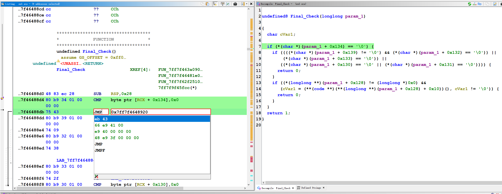
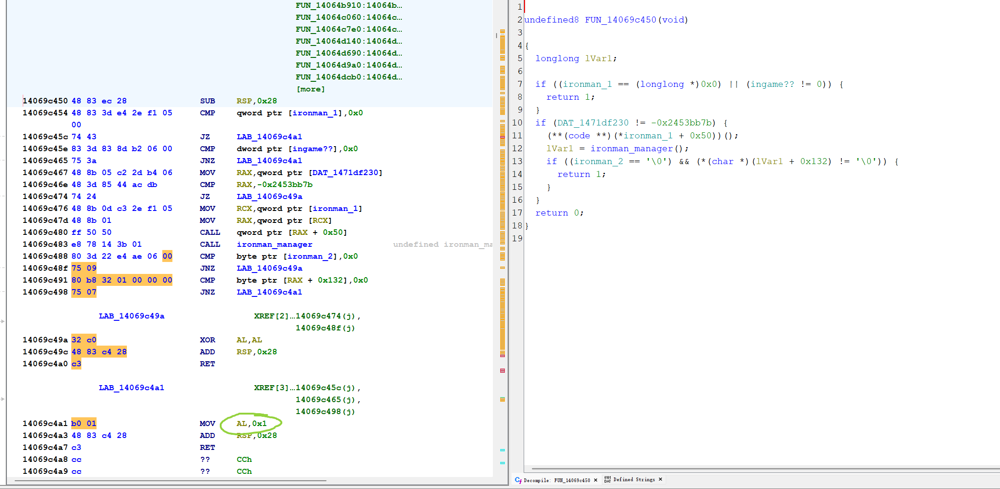
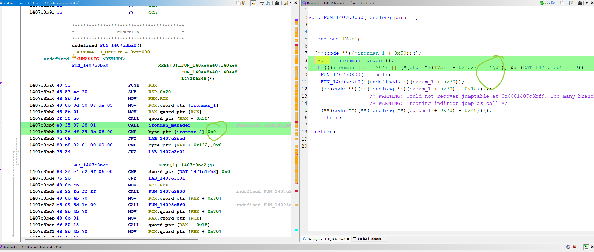
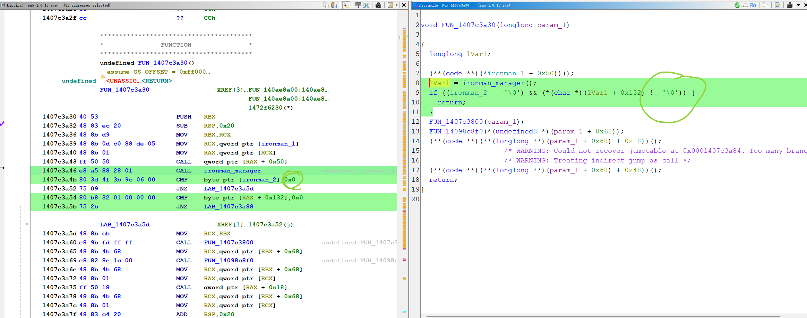

# 🛠️ EU5 Patcher Technical Details

This document outlines the key memory locations and checks identified for patching Europa Universalis V to enable achievements unconditionally.

---

## 🏆 Achievement Check
**String:** `CanGetAchievements`

Determines if the current game session is eligible for achievements.

---

## 🛡️ Ironman Check
**String:** `GameIsIronman`

Checks if the game is in Ironman mode. We patch this to allow non-Ironman features (like unrestricted saves) while still qualifying for achievements.

---

## 💻 Console Check
**String:** `BLOCK_COMMAND_MULTIPLAYER_IRONMAN`

Prevents the use of the developer console in Ironman/Multiplayer. Patching this re-enables console commands.

---

## 📂 Load Button
**String:** `LoadIngame`

Modifications to enable loading saves in-game under Ironman conditions.

---

## 💾 Save Button
**String:** `LoadIngame` (followed by `LoadIngame`)

Enabling the save button functionality.

---

## 📜 Credits

This research is based on:
- [Enabling Achievements in Stellaris With Mods (All game versions) [SRE]](https://steamcommunity.com/sharedfiles/filedetails/?id=2460079052)
